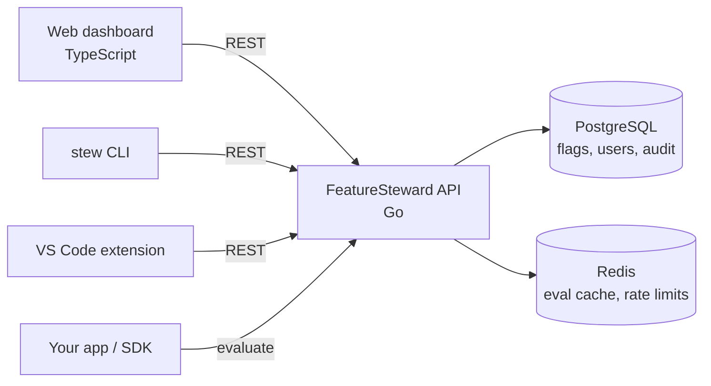

# FeatureSteward

> A self-hosted feature-flag and config service. Toggle features safely, roll out gradually, and know who's accountable for every flag.


---

## Why this exists

Shipping code and releasing features shouldn't be the same event. Feature flags let teams deploy code "dark," then turn it on for a few users, a percentage of traffic, or everyone, without redeploying.

Most teams either pay for a hosted service or hack flags into config files with no history of who changed what, and no clear owner once a flag goes stale. **FeatureSteward** is a small, self-hosted alternative built around four ideas:

- **Every flag has a steward:** A named person accountable for it, borrowed from the *Feature Steward* role in FaST Agile.
- **Safe by default:** Production changes require approval from a second person.
- **Accountable:** Every change is recorded in an append-only audit log.
- **Fast to evaluate:** Flag checks are cached and served from a lightweight API.

---

## Features

- [x] Boolean flags per environment (`dev`, `staging`, `prod`)
- [x] Percentage rollouts (deterministic per user)
- [x] Targeting rules (user IDs, groups)
- [x] A steward (owner) on every flag
- [x] Role-based access control (viewer / editor / approver / admin)
- [x] Approval workflow for production changes, routed to the flag's steward
- [ ] Stale-flag detection with steward notifications
- [x] Append-only audit log (tamper-evident hash chain as a stretch goal)
- [ ] Redis-backed evaluation cache
- [ ] Rate-limited evaluation endpoint
- [x] Web dashboard
- [x] `stew` command-line tool
- [ ] VS Code extension (hover status and steward, autocomplete flag keys, stale-flag finder)

---

## Architecture



---

## Tech stack

| Layer | Choice |
|---|---|
| Backend | Go (`net/http`) |
| CLI | Go |
| Database | PostgreSQL + SQL migrations |
| Cache | Redis |
| Frontend | TypeScript, HTML, CSS |
| Infra | Docker, Docker Compose, GitHub Actions |

---

## Quick start

**Prerequisites:** Docker, and Go 1.27 or later for the `make` commands.

```bash
git clone https://github.com/Melmonster13/featuresteward.git
cd featuresteward
cp .env.example .env
docker compose up -d --build
make migrate
make admin HANDLE=yourname   # prints an API token once; save it
```

Open http://localhost:8080 and sign in with that token. The API is at http://localhost:8080/api/v1.

To work on the dashboard with live reload, run `make web-dev` (needs Node.js 24) and open http://localhost:3000. It forwards API calls to the server on port 8080.

---

## The dashboard

Sign in with an API token; the dashboard swaps it for a 12-hour session.

- **Flags:** every flag's state per environment and its steward, with search and filters for environment and steward (yours, or none).
- **Flag page:** turn a flag on or off, set its rollout and targeting rules per environment, reassign the steward, archive it, and read its history. In `prod`, saving becomes **Request change**, except turning the flag off.
- **Reviews:** change requests waiting for you, your own, and recently closed ones, with the current and requested settings side by side.
- **Your tokens:** create tokens for the CLI and scripts, and revoke them.
- **Admin pages:** add users (with a first sign-in token to send them), change roles, disable users, manage SDK keys and environments.

Controls you can't use are disabled with the reason shown, and the server enforces the same rules. New tokens and SDK keys are shown once.

---

## The `stew` CLI

Install (needs Go 1.27.1 or later), or run `make stew` to build `bin/stew` from a checkout:

```bash
go install github.com/Melmonster13/featuresteward/cmd/stew@latest
```

Log in with an API token. `stew` reads it from stdin, not a flag, so it stays out of your shell history:

```bash
stew login --url http://localhost:8080   # paste the token at the prompt
stew whoami
```

The token is saved to `~/.config/stew/config.json` (mode `0600`). `stew logout` revokes it on the server and deletes the file. In CI, set `STEW_URL` and `STEW_TOKEN` instead. `stew` refuses to send a token over plain `http` except to `localhost`.

Common commands:

```bash
stew list --env dev                        # flags in an environment
stew list --steward none                   # flags with no active steward
stew status new-checkout                   # state per environment, rules, steward
stew create new-checkout --name "New checkout"
stew rollout new-checkout staging 25       # 25% of users
stew toggle new-checkout staging on
stew steward new-checkout @sam             # hand the flag to another steward
stew archive new-checkout --yes            # admins only

stew rollout new-checkout prod 25 --reason "launch to a quarter"   # files a change request
stew requests                              # pending requests, and whether you can review them
stew approve 12 --comment "ship it"        # or: stew reject 12, stew cancel 12
stew toggle new-checkout prod off          # the kill switch applies immediately
```

`toggle` and `rollout` change one setting and keep the rest, including targeting rules. Every change carries an `Idempotency-Key`, so `stew` retries network errors and 502/503/504 responses without applying a change twice. See [Production approvals](#production-approvals) for how `prod` changes work.

For scripts, most commands take `--json`, and exit codes tell failures apart:

| Code | Meaning |
|---|---|
| 0 | Success |
| 1 | Other error |
| 2 | Bad usage |
| 3 | Not logged in, or not allowed |
| 4 | Flag or environment not found |

`stew stale` arrives with stale-flag detection (Milestone 7).

---

## Usage

### Authentication

Every API request sends `Authorization: Bearer <credential>`. There are two kinds:

- **API tokens** (`fs_…`) belong to a user and carry that user's role. Changes made with one are recorded under the user's handle in the audit log.
- **SDK keys** (`fs_sdk_…`) belong to one environment and can only call `/api/v1/evaluate` in that environment. Give these to your applications.

Both are shown once when created. Only a SHA-256 hash is stored.

**Browser sessions:** The dashboard signs in by sending an API token to `POST /api/v1/session`, which sets an `HttpOnly`, `SameSite=Strict` session cookie for 12 hours. The cookie is `Secure` everywhere except `http://localhost`, so the dashboard needs HTTPS in production. A session ends at logout (`DELETE /api/v1/session`), or when its token is revoked or its user is disabled. Requests that use the cookie to change something must come from the dashboard's own origin.

### Evaluate a flag

```bash
curl -X POST http://localhost:8080/api/v1/evaluate \
  -H "Authorization: Bearer <sdk-key or token>" \
  -H "Content-Type: application/json" \
  -d '{"flag": "new-checkout", "environment": "prod", "user_id": "user-42"}'
```

```json
{ "flag": "new-checkout", "enabled": true, "reason": "percentage_rollout" }
```

### Safe retries

Send an `Idempotency-Key` header (any unique string, up to 255 characters) with a `POST`, `PUT`, or `DELETE`. If the same user retries with the same key and the same request within 24 hours, the API returns the original response with `Idempotent-Replayed: true` instead of applying the change again. Reusing a key for a different request returns `422`.

Responses that contain a new API token or SDK key are replayed without the secret, since secrets are never stored. Revoke the replayed `id` and create a new one if the first response was lost.

### How percentage rollouts work

Each user is assigned a stable bucket from `hash(flag_key + user_id) % 100`. A flag at 25% is on for buckets 0–24. The same user always gets the same result, and raising the percentage only adds users; nobody who already has the feature loses it.

---

## Stewards and roles

**Steward:** Every flag has one. The steward is the point of contact for that flag, reviews production change requests for it, and is notified when it goes stale. Stewardship is per flag, not a permission level. A new flag's steward is its creator unless another is named; stewards must be active editors or above. Admins can reassign any flag, and a steward can hand their own flag to someone else. `GET /api/v1/flags?steward=none` lists flags with no steward or a disabled one.

**Roles** control what each user can do across the system:

| Role | Can do |
|---|---|
| Viewer | See flags, stewards, and audit history |
| Editor | Create and change flags in `dev` / `staging`, request changes in `prod`, and turn `prod` flags off |
| Approver | Approve or reject `prod` change requests |
| Admin | Manage users, roles, environments, and steward assignments |

Roles are cumulative: each includes the permissions of the roles above it in the table. Permissions are enforced on the server for every request, never only in the UI. Self-approval is blocked.

`prod` is a **protected** environment; admins can protect others. Only admins can archive flags.

### Production approvals

A change to a protected environment is a **change request** that someone else approves:

1. An editor requests the new settings, with an optional reason: **Request change** in the dashboard, `stew rollout … prod`, or `POST /api/v1/flags/{key}/environments/prod/requests`.
2. The flag's steward, an approver, or an admin approves or rejects it, optionally with a comment. The requester can't review their own request, but can cancel it.
3. Approving applies the change, but only if `prod` still has the settings the request was based on. If someone changed it in the meantime, the approval fails and the request needs to be made again.

Requests that nobody reviews expire after 7 days, and only one request per flag and environment can be pending at a time.

Two changes skip approval:

- **The kill switch:** anyone who can edit can turn a flag off in `prod` right away, as long as nothing else changes.
- **Emergency changes:** an admin can apply any change directly by giving a reason (`"reason"` in the API, `--emergency` in `stew`). The reason is kept in the audit log.

Every request, review, and change is recorded in the flag's history.

---

## Configuration

| Variable | Description | Default |
|---|---|---|
| `DATABASE_URL` | PostgreSQL connection string | — |
| `REDIS_URL` | Redis connection string. Optional: without it, or while Redis is down, evaluations aren't cached or rate limited. `/healthz` reports its status. | — |
| `PORT` | API port | `8080` |
| `CACHE_TTL_SECONDS` | Evaluation cache lifetime | `30` |
| `RATE_LIMIT_PER_MIN` | Evaluation requests per client per minute | `600` |
| `STALE_AFTER_DAYS` | Days a flag can sit unchanged at 0% or 100% before it's flagged stale | `30` |

---

## Project structure

```
cmd/featuresteward/  API server entry point
cmd/stew/            CLI entry point
internal/flag/       flag domain and business logic
internal/eval/       rule matching and rollout hashing
internal/audit/      append-only audit events
internal/auth/       authentication and RBAC
internal/store/      PostgreSQL repositories
internal/httpapi/    handlers, middleware, errors
migrations/          versioned SQL (up/down)
web/                 dashboard
extensions/vscode/   VS Code extension
```

---

## Design decisions

- **Postgres is the source of truth; Redis is only a cache.** If Redis goes down, evaluation falls back to the database.
- **The audit log is append-only.** Events are never updated or deleted.
- **The CLI, dashboard, and extension are all API clients.** Every rule lives in the server, so no client can bypass approvals.
- **Storage sits behind interfaces**, so business logic is tested against in-memory fakes.
- **State-changing requests accept an idempotency key**, so retries can't apply a change twice.
- **An approval applies only to the settings it was requested against.** Approving checks and changes `prod` in one transaction, so an approval can't overwrite a newer change.

---

## Testing

```bash
make test         # unit tests
make test-int     # integration tests (requires Docker)
cd web && npm test  # dashboard tests
```

CI runs `go vet`, unit and integration tests, `govulncheck` and `npm audit`, a secret scan, the dashboard's typecheck, tests, and build, a Docker build, and a `stew` build for Linux, macOS, and Windows on every pull request.

---

## Roadmap

1. ✅ Core flags + evaluation API
2. ✅ Auth, RBAC, and audit log
3. ✅ Stewards + `stew` CLI
4. ✅ Dashboard
5. ✅ Approvals for production
6. Redis cache + rate limiting
7. Stale-flag detection
8. VS Code extension
9. Stretch: OpenFeature-compatible provider

---

## Author

Built by **Mel** · [MelStackBox](https://melstackbox.com) · [GitHub](https://github.com/Melmonster13)

## License

[MIT](LICENSE)
