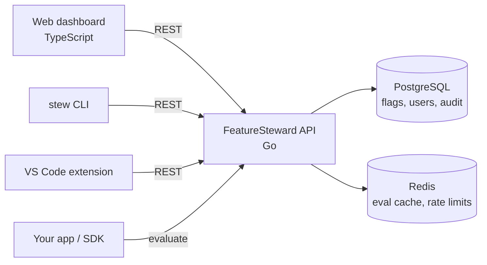

# FeatureSteward

> A self-hosted feature-flag and config service. Toggle features safely, roll out gradually, and know who's accountable for every flag.


---

## Why this exists

Shipping code and releasing features shouldn't be the same event. Feature flags let teams deploy code "dark," then turn it on for a few users, a percentage of traffic, or everyone, without redeploying.

Most teams either pay for a hosted service or hack flags into config files with no history of who changed what, and no clear owner once a flag goes stale. **FeatureSteward** is a small, self-hosted alternative built around four ideas:

- **Every flag has a steward:** A named person accountable for it, borrowed from the *Feature Steward* role in FaST Agile.
- **Safe by default:** Production changes require approval from a second person.
- **Accountable:** Every change is recorded in an append-only audit log.
- **Fast to evaluate:** Flag checks are cached and served from a lightweight API.

---

## Features

- [ ] Boolean flags per environment (`dev`, `staging`, `prod`)
- [ ] Percentage rollouts (deterministic per user)
- [ ] Targeting rules (user IDs, groups)
- [ ] A steward (owner) on every flag
- [ ] Role-based access control (viewer / editor / approver / admin)
- [ ] Approval workflow for production changes, routed to the flag's steward
- [ ] Stale-flag detection with steward notifications
- [ ] Append-only audit log (tamper-evident hash chain as a stretch goal)
- [ ] Redis-backed evaluation cache
- [ ] Rate-limited evaluation endpoint
- [ ] Web dashboard
- [ ] `stew` command-line tool
- [ ] VS Code extension (hover status and steward, autocomplete flag keys, stale-flag finder)

---

## Architecture



---

## Tech stack

| Layer | Choice |
|---|---|
| Backend | Go (`net/http`) |
| CLI | Go |
| Database | PostgreSQL + SQL migrations |
| Cache | Redis |
| Frontend | TypeScript, HTML, CSS |
| Infra | Docker, Docker Compose, GitHub Actions |

---

## Quick start

**Prerequisites:** Docker and Docker Compose.

```bash
git clone https://github.com/Melmonster13/featuresteward.git
cd featuresteward
cp .env.example .env
echo "API_KEY=$(openssl rand -hex 32)" >> .env
docker compose up --build
```

- API: http://localhost:8080
- Dashboard: http://localhost:3000

Run migrations and seed demo data:

```bash
make migrate
make seed
```

---

## The `stew` CLI

Install:

```bash
go install github.com/Melmonster13/featuresteward/cmd/stew@latest
stew login --url http://localhost:8080
```

Common commands:

```bash
stew list --env dev                      # list flags in an environment
stew status new-checkout                 # state per environment + steward
stew toggle new-checkout --env dev       # flip a flag (dev/staging)
stew rollout new-checkout 25 --env prod  # request a 25% prod rollout (needs approval)
stew stale                               # flags that look safe to remove
stew steward new-checkout @mel           # assign a flag's steward
```

Production changes made with `stew` go through the same approval workflow as the dashboard.

---

## Usage

### Evaluate a flag

```bash
curl -X POST http://localhost:8080/api/v1/evaluate \
  -H "Authorization: Bearer <token>" \
  -H "Content-Type: application/json" \
  -d '{"flag": "new-checkout", "environment": "prod", "user_id": "user-42"}'
```

```json
{ "flag": "new-checkout", "enabled": true, "reason": "percentage_rollout" }
```

### How percentage rollouts work

Each user is assigned a stable bucket from `hash(flag_key + user_id) % 100`. A flag at 25% is on for buckets 0–24. The same user always gets the same result, and raising the percentage only adds users; nobody who already has the feature loses it.

---

## Stewards and roles

**Steward:** Every flag has one. The steward is the point of contact for that flag, reviews production change requests for it, and is notified when it goes stale. Stewardship is per flag, not a permission level.

**Roles** control what each user can do across the system:

| Role | Can do |
|---|---|
| Viewer | See flags, stewards, and audit history |
| Editor | Create and change flags in `dev` / `staging` |
| Approver | Approve or reject `prod` change requests |
| Admin | Manage users, roles, environments, and steward assignments |

Permissions are enforced on the server for every request, never only in the UI. Self-approval is blocked.

---

## Configuration

| Variable | Description | Default |
|---|---|---|
| `DATABASE_URL` | PostgreSQL connection string | — |
| `REDIS_URL` | Redis connection string | — |
| `PORT` | API port | `8080` |
| `API_KEY` | Bearer token for the API (at least 32 characters) | — |
| `CACHE_TTL_SECONDS` | Evaluation cache lifetime | `30` |
| `RATE_LIMIT_PER_MIN` | Evaluation requests per client per minute | `600` |
| `STALE_AFTER_DAYS` | Days a flag can sit unchanged at 0% or 100% before it's flagged stale | `30` |

---

## Project structure

```
cmd/featuresteward/  API server entry point
cmd/stew/            CLI entry point
internal/flag/       flag domain and business logic
internal/eval/       rule matching and rollout hashing
internal/audit/      append-only audit events
internal/auth/       authentication and RBAC
internal/store/      PostgreSQL repositories
internal/httpapi/    handlers, middleware, errors
migrations/          versioned SQL (up/down)
web/                 dashboard
extensions/vscode/   VS Code extension
```

---

## Design decisions

- **Postgres is the source of truth; Redis is only a cache.** If Redis goes down, evaluation falls back to the database.
- **The audit log is append-only.** Events are never updated or deleted.
- **The CLI, dashboard, and extension are all API clients.** Every rule lives in the server, so no client can bypass approvals.
- **Storage sits behind interfaces**, so business logic is tested against in-memory fakes.
- **State-changing requests accept an idempotency key**, so retries can't apply a change twice.

---

## Testing

```bash
make test         # unit tests
make test-int     # integration tests (requires Docker)
```

CI runs linting, tests, and a Docker build on every pull request.

---

## Roadmap

1. Core flags + evaluation API
2. Auth, RBAC, and audit log
3. Stewards + `stew` CLI
4. Dashboard
5. Approvals for production
6. Redis cache + rate limiting
7. Stale-flag detection
8. VS Code extension
9. Stretch: OpenFeature-compatible provider

---

## Author

Built by **Mel** · [MelStackBox](https://melstackbox.com) · [GitHub](https://github.com/Melmonster13)

## License

MIT
